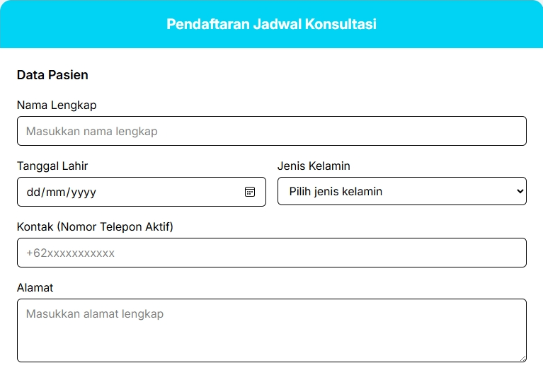

# "YULJE Medical Center" - CRUD Jadwal Konsultasi Dokter dan Pasien
_**Web App - Tugas Akhir Pemrograman Web**_  
_Disclaimer: Nama dan inspirasi hanya berupa objek fiktif belaka_  

**Deskripsi**
Projek aplikasi ini bertujuan untuk mengaplikasikan *study case* jadwal konsultasi antara dokter dengan pasien. Program menyajikan informasi mengenai penjadwalan yang telah dipesan oleh pasien dan status dari jadwal tersebut, mulai dari tanggal, deskripsi, status, dan lain-lain.

**Flow Utama**
- Mengisi data diri pasien, jadwal konsultasi tanggal, jam, spesialis, keluhan (dokter diassign oleh sistem).
- Jika berhasil, mengarah ke pembayaran/transaksi.
- Jika gagal, kembali ke halaman input konsultasi.

## Teknologi
- HTML5
- CSS3
- TailwindCSS
- Bootstrap 5 Icons
- NodeJS
- ExpressJS
- EJS (Embedded JavaScript)
- MySQL (PhpMyAdmin)

**Packages Installed**
- mysql2
- express
- ejs

**Routes / Endpoints**
- http://localhost:3000/
- http://localhost:3000/pengajuan
- http://localhost:3000/proses
- http://localhost:3000/proses/transaksi
- http://localhost:3000/proses/antrian
- http://localhost:3000/jadwal
- http://localhost:3000/jadwal/antrian
- http://localhost:3000/jadwal/dokter
- http://localhost:3000/admin/
- http://localhost:3000/admin/jadwal/:id
- http://localhost:3000/admin/jadwal/:id/delete
- http://localhost:3000/admin/jadwal/:id/done

## Database Tables

.png)

- **Jadwal_Konsultasi**
  - *id_konsultasi* INT AUTO_INCREMENT(P)
  - *id_pasien* VARCHAR(50) (F)
  - *id_dokter* VARCHAR(50) (F)
  - *tanggal* DATE
  - *waktu* TIME
  - *keluhan* VARCHAR(255)
  - *status* VARCHAR(30)
  
- **Riwayat_Konsultasi**
  - *id_riwayat* INT/SERIAL AUTO_INCREMENT(P)
  - *id_pasien* VARCHAR(50) (F)
  - *id_dokter* VARCHAR(50) (F)
  - *tanggal* DATE
  - *waktu* TIME
  - *keluhan* VARCHAR(255)
  - *status* VARCHAR(30)
  - *diagnosis* VARCHAR(255)
  - *tindakan* VARCHAR(255)
  
- **Dokter**
  - *id_dokter* INT AUTO_INCREMENT(P)
  - *nama_dokter* VARCHAR(50)
  - *spesialis* VARCHAR(50)
  - *kontak* VARCHAR(30)
  - *id_praktik* VARCHAR(100) (F)
  
- **Jadwal_Praktik**
  - *id_praktik* INT AUTO_INCREMENT(P)
  - *hari* VARCHAR(10)
  - *waktu_mulai* TIME
  - *waktu_selesai* TIME
  
- **Spesialis**
  - *id_spesialis* INT AUTO_INCREMENT(P)
  - *nama_spesialis* VARCHAR(30)
  - *biaya* INT
  
- **Pasien**
  - *id_pasien* INT AUTO_INCREMENT(P)
  - *nama_pasien* VARCHAR(50)
  - *jenis_kelamin* VARCHAR(10)
  - *tanggal_lahir* DATE
  - *kontak* VARCHAR(30)
  - *alamat* VARCHAR(255)
  
- **Transaksi**
  - *id_transaksi* INT AUTO_INCREMENT(P)
  - *id_konsultasi* INT (F)
  - *nominal* INT
  - *metode_bayar* VARCHAR(30)
  - *tanggal_transaksi* DATE
  - *waktu_transaksi* TIME
  - *status* VARCHAR(30)

##### Struktur Direktori Projek
yulje-app/  
├─ database/  
├─ node_modules/  
├─ public/  
│  ├─ css/  
│  ├─ img/  
│  ├─ schemas/  
├─ views/  
│  ├─ modules/  
│  │  ├─ navbar.ejs  
│  │  ├─ footer.ejs  
│  ├─ index.ejs  
│  ├─ pengajuan.ejs  
│  ├─ jadwal.ejs  
│  ├─ proses.ejs  
│  ├─ jadwal-dokter.ejs  
│  ├─ admin.ejs  
├─ .gitignore  
├─ db.js  
├─ index.js  
├─ package-lock.json  
├─ package.json  
├─ README.md  
  

### FAQ Frequently Asked Questions
**Q: Bagaimana cara menjalankan aplikasi?**  
A: Berikut adalah penjelasan singkat:
1. **Copy repository** ini; 
2. Buka **PhpMyAdmin > Import** (atau http://localhost/phpmyadmin/index.php?route=/server/import);
3. **Copy** isi file [`database/yulje_pw.sql`](database/yulje_pw.sql) lalu paste.
4. **Run** / jalankan script SQL-nya untuk membuat database beserta tabel-tabelnya. *Note: isi tabel kosong.*
5. Buka folder projek, lalu instalasi package yang ada sesuai list di atas halaman ini.
6. Jalankan `node index.js`. Pastikan untuk memeriksa konfigurasi db.js terkait user dan password database.
7. Buka browser, lalu akses alamat http://localhost:3000.

**Q: Apakah aplikasi ini Open Source?**  
A: Tidak, source-code aplikasi ini hanya dapat digunakan untuk penggunaan pribadi dan tidak diperkenankan untuk mengganti kepemilikan asli.